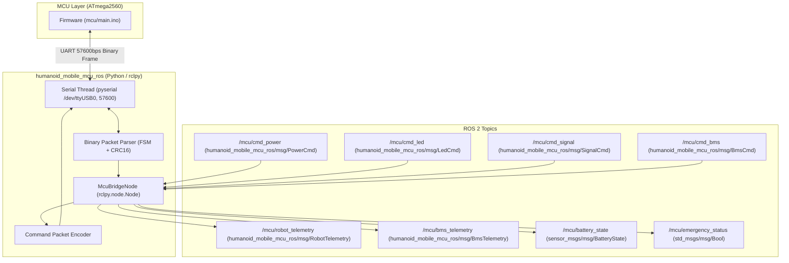

# humanoid_mobile_mcu_ros 패키지 생성 계획서 (개정본 v2)

## 1. 개요 (Overview)
본 계획은 사용자 피드백을 반영하여, **커스텀 메시지(`msg/`) 생성을 위한 `ament_cmake` 기반 빌드 환경**과 **MCU와의 시리얼 통신을 담당하는 Python (`rclpy` + `pyserial`) 기반 브릿지 노드**를 결합한 하이브리드 ROS 2 패키지 **`humanoid_mobile_mcu_ros`**를 생성하고 구현하는 계획입니다.

---

## 2. 사용자 피드백 반영 사항 (User Feedback Incorporated)

> [!IMPORTANT]
> 1. **커스텀 메시지 빌드 (`ament_cmake` / `rosidl_generate_interfaces`)**:
>    - ROS 2의 표준 방식으로 C++ 및 Python 모두에서 커스텀 메시지를 완벽히 사용할 수 있도록 `ament_cmake` 기반으로 `msg/` 인터페이스를 빌드합니다.
> 2. **시리얼 통신 브릿지 노드는 Python으로 구현**:
>    - MCU 시리얼 통신(`57600 bps`, 바이너리 프로토콜, CRC16 검증) 및 ROS 2 토픽 발행/구독 로직을 **Python (`rclpy`, `pyserial`, `threading`)**으로 구현합니다.
>    - 기존에 검증된 `tools/mcu_serial_tester.py`의 고신뢰성 FSM 파서 및 패킷 인코더/디코더 로직을 모듈화하여 적극 활용합니다.
> 3. **패키지 내 파이썬 노드 설치**:
>    - `CMakeLists.txt`에서 `install(PROGRAMS ... DESTINATION lib/${PROJECT_NAME})` 또는 `ament_python_install_package`를 통해 `ros2 run humanoid_mobile_mcu_ros mcu_bridge_node` 및 `ros2 launch humanoid_mobile_mcu_ros mcu_bridge.launch.py`로 즉시 실행 가능하도록 구성합니다.

---

## 3. 시스템 아키텍처 및 토픽 인터페이스



---

## 4. 상세 파일 구성 및 변경 내역 (Proposed Changes)

### [NEW] `humanoid_mobile_mcu_ros/`

```text
humanoid_mobile_mcu_ros/
├── CMakeLists.txt
├── package.xml
├── msg/
│   ├── RobotTelemetry.msg
│   ├── BmsTelemetry.msg
│   ├── PowerCmd.msg
│   ├── LedCmd.msg
│   ├── SignalCmd.msg
│   └── BmsCmd.msg
├── humanoid_mobile_mcu_ros/
│   ├── __init__.py
│   ├── protocol.py             # 바이너리 패킷 프레임, CRC16, FSM 파서, 인코더/디코더
│   └── mcu_bridge_node.py      # rclpy 기반 MCU 시리얼 브릿지 노드 본체
├── scripts/
│   └── mcu_bridge_node         # Python 노드 실행 진입점 (Executable)
├── launch/
│   └── mcu_bridge.launch.py    # Launch 파일
└── config/
    └── mcu_params.yaml         # 시리얼 포트(/dev/ttyUSB0), 보드레이트(57600) 등 파라미터 파일
```

#### 1) 빌드 및 패키지 설정
- **`package.xml`**:
  - `buildtool_depend`: `ament_cmake`, `ament_cmake_python`, `rosidl_default_generators`
  - `depend`: `rclpy`, `std_msgs`, `sensor_msgs`
  - `exec_depend`: `python3-serial`, `rosidl_default_runtime`
- **`CMakeLists.txt`**:
  - `rosidl_generate_interfaces`로 `msg/*.msg` 메시지 생성
  - `ament_python_install_package`로 파이썬 모듈 설치
  - `install(PROGRAMS scripts/mcu_bridge_node DESTINATION lib/${PROJECT_NAME})`로 노드 실행 바이너리 등록
  - `launch/`, `config/` 디렉터리 설치 규칙 정의

#### 2) 커스텀 메시지 정의 (`msg/`)
- **`msg/RobotTelemetry.msg`**:
  - `std_msgs/Header header`
  - `bool pwr_btn`, `bool start_btn`, `bool stop_btn`, `bool manu_sw`
  - `bool nav_pc_live`, `bool humanoid_pc_live`, `bool ai_pc_live`
  - `bool safety_ems`, `bool manu_chg_dock`, `bool is_charging`
  - `bool pwr_hold`, `bool volt24v_1`, `bool volt24v_2`, `bool chg_on_enable`
  - `bool lamp_red`, `bool lamp_grn`, `bool lamp_yel`, `bool buzzer`
  - `float32 chg_current_adc`
  - `uint8 led_current_mode`
  - `uint32 uptime_sec`
- **`msg/BmsTelemetry.msg`**:
  - `std_msgs/Header header`
  - `float32 voltage`, `float32 current`, `float32 soc`, `float32 soh`, `float32 temp`, `bool is_valid`
- **`msg/PowerCmd.msg`**:
  - 대상 및 동작 상수 정의 (`TARGET_HUMANOID_PC=1`, `TARGET_AI_PC=2`, `TARGET_24V_CONV_1=3`, `TARGET_24V_CONV_2=4`, `TARGET_MAIN_PC=5`, `ACTION_OFF=0`, `ACTION_ON=1`, `ACTION_PULSE=2`)
  - `uint8 target_device`, `uint8 action`
- **`msg/LedCmd.msg`**:
  - LED 모드 상수 정의 및 `uint8 mode`, `uint8 r`, `uint8 g`, `uint8 b`, `uint8 brightness`
- **`msg/SignalCmd.msg`**:
  - `uint8 lamp_red`, `uint8 lamp_grn`, `uint8 lamp_yel`, `uint8 buzzer`, `uint8 tm_remote` (0: OFF, 1: ON, 255: 유지)
- **`msg/BmsCmd.msg`**:
  - `uint8 bms_reset_pulse`, `uint8 chg_enable`

#### 3) Python 프로토콜 & 브릿지 노드 (`humanoid_mobile_mcu_ros/`)
- **`protocol.py`**:
  - 패킷 프레임(`0xAA 0x55`), 메시지 ID 상수(`0x01` ~ `0x14`)
  - CRC16-CCITT 계산 함수
  - FSM 상태머신 패킷 파서(`BinaryPacketParser`)
  - 각 커맨드 패킷 인코더(`build_power_cmd`, `build_led_cmd`, `build_signal_cmd`, `build_bms_cmd`, `build_request_info`)
- **`mcu_bridge_node.py`**:
  - `rclpy.node.Node` 상속
  - `pyserial` 백그라운드 수신 스레드 관리 및 시리얼 연결 끊김 시 자동 재연결(Auto-reconnect) 루프
  - 텔레메트리 패킷 디코딩 후 ROS 2 토픽 발행:
    - `/mcu/robot_telemetry` (`RobotTelemetry`)
    - `/mcu/bms_telemetry` (`BmsTelemetry`)
    - `/mcu/battery_state` (`sensor_msgs/msg/BatteryState`)
    - `/mcu/emergency_status` (`std_msgs/msg/Bool`)
  - 커맨드 토픽 구독 콜백에서 패킷 빌드 후 시리얼 즉시 송신:
    - `/mcu/cmd_power`, `/mcu/cmd_led`, `/mcu/cmd_signal`, `/mcu/cmd_bms`

#### 4) 런치 및 설정 파일 (`launch/`, `config/`)
- **`config/mcu_params.yaml`**: `port: "/dev/ttyUSB0"`, `baud_rate: 57600`, `reconnect_interval_sec: 2.0`
- **`launch/mcu_bridge.launch.py`**: 파라미터 파일 로드 및 노드 실행 지원

---

## 5. 검증 계획 (Verification Plan)

### 1) 빌드 검증 (`colcon build`)
- 워크스페이스에서 `colcon build --packages-select humanoid_mobile_mcu_ros` 실행.
- C++ 및 Python 인터페이스(`.msg`)가 정상 생성되고 파이썬 패키지 및 스크립트가 설치되는지 확인.

### 2) 메시지 및 모듈 import 검증
- `source install/setup.bash` 후 `python3 -c "import humanoid_mobile_mcu_ros; from humanoid_mobile_mcu_ros.msg import RobotTelemetry, BmsTelemetry, PowerCmd, LedCmd, SignalCmd, BmsCmd; print('Imports OK!')"` 테스트.

### 3) 노드 실행 및 가상 시리얼 통신 검증
- 가상 시리얼 루프(`socat`) 또는 단위 테스트 도구를 통해:
  - `ros2 launch humanoid_mobile_mcu_ros mcu_bridge.launch.py` 기동 확인
  - `ros2 topic list` 및 토픽 echo 확인
  - 커맨드 토픽 발행 시 MCU 패킷 정상 송신 확인
