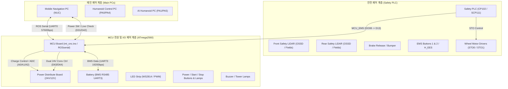

# Mobile Humanoid MCU Firmware & Hardware IO List 분석 보고서

본 보고서는 레거시 MCU 펌웨어 소스코드인 [`mcu/mt_cnc.ino`](file:///Users/zzang/Documents/VoidDocs/works/workspace/projects_wonik/20260811_w_humanoid/workspace/mobile/mcu/mt_cnc.ino)와 하드웨어 설계 명세서인 [`raw_data/mobile_mcu/Mobile Humanoid_IO_List_ver1.0.xlsx`](file:///Users/zzang/Documents/VoidDocs/works/workspace/projects_wonik/20260811_w_humanoid/workspace/mobile/raw_data/mobile_mcu/Mobile%20Humanoid_IO_List_ver1.0.xlsx)의 세부 내용을 분석하고, 시스템 아키텍처 및 핀 맵 매핑 차이점을 도출한 결과입니다.

---

## 1. 개요 및 시스템 아키텍처

---

## 2. `mcu/mt_cnc.ino` 펌웨어 상세 분석

### 2.1 펌웨어 기본 정보
- **타겟 MCU**: Arduino Mega (ATmega2560) 기반
- **버전**: `MT_CNC MCU 1.01` (기존 Wonik QnC CNC 5th 머신텐딩 로봇 기반)
- **통신 인터페이스**:
  - **ROS Node**: `rosserial` 통신 (`UART0`, 57600 baud)
  - **BMS 통신**: 배터리 관리 시스템 인터페이스 (`UART3`, 19200 baud, 패킷 기반 CRC 검증)

### 2.2 ROS 토픽 정의

#### Publishers (MCU → ROS / PC)
| 토픽명 | 메시지 타입 | 주기 / 트리거 | 설명 |
| :--- | :---: | :---: | :--- |
| `charging_status` | `std_msgs/Bool` | 1000ms / 상태변화 | 충전 중 여부 상태 |
| `current_adc` | `std_msgs/Float32` | 1000ms | 충전 전류 ADC 측정값 |
| `emerg_mode2` | `std_msgs/Bool` | 상태 변경 시 | 비상정지(Emergency) 활성화 여부 |
| `pwr_btn` | `std_msgs/Bool` | 버튼 입력 시 | 전원 버튼 입력 상태 (PC 종료 시퀀스용) |
| `manual_charging` | `std_msgs/Bool` | 100ms | 수동 충전 단자 감지 상태 |
| `mcu_sw_version` | `std_msgs/String` | 5000ms | MCU 펌웨어 버전 문자열 (`MT_CNC MCU 1.01`) |
| `led_status` | `std_msgs/UInt8` | 2000ms / 명령 시 | 상부 LED (LED1) 현재 동작 상태 코드 |
| `led2_status` | `std_msgs/UInt8` | 2000ms / 명령 시 | 하부/측면 LED (LED2) 현재 동작 상태 코드 |
| `batt_voltage_bms` | `std_msgs/Float32` | 1000ms | BMS 배터리 전압 |
| `batt_current_bms` | `std_msgs/Float32` | 1000ms | BMS 배터리 전류 |
| `batt_soc_bms` | `std_msgs/Float32` | 1000ms | BMS 배터리 잔량 (SoC %) |
| `batt_temp_bms` | `std_msgs/Float32` | 1000ms | BMS 배터리 온도 |
| `batt_soh_bms` | `std_msgs/Float32` | 1000ms | BMS 배터리 수명 (SoH %) |
| `stop_btn` | `std_msgs/Bool` | 100ms | 미션 정지(Mission Stop) 버튼 상태 |
| `quartz_sensor` | `std_msgs/Bool` | 500ms | 쿼츠 감지 센서 1 상태 (레거시) |
| `amr_quartz_sensor` | `std_msgs/Bool` | 500ms | AMR 쿼츠 감지 센서 2 상태 (레거시) |

#### Subscribers (ROS / PC → MCU)
| 토픽명 | 메시지 타입 | 콜백 함수 | 동작 설명 |
| :--- | :---: | :---: | :--- |
| `cmd_led` | `std_msgs/UInt16` | `led_cb` | 상부 LED 동작 패턴 제어 (색상, 블링크, 와이프 등) |
| `cmd_led2` | `std_msgs/UInt16` | `led2_cb` | 하부/인디케이터 LED 동작 패턴 제어 |
| `cmd_ext_emerg` | `std_msgs/Bool` | `ext_emerg_cb` | 소프트웨어 외부 비상정지 트리거 |
| `cmd_bat_bms_pwr_enable` | `std_msgs/Bool` | `bat_bms_pwr_enable_cb` | BMS 전원 스위치 ON/OFF 제어 (`BMS_SW`) |
| `cmd_buzzer` | `std_msgs/Bool` | `buzzer_cb` | 부저 출력 ON/OFF |
| `qr_cmd` | `std_msgs/Bool` | `qr_trigger_cmd_cb` | QR 코드 리더기 전원 트리거 |
| `chg_on_enable` | `std_msgs/Bool` | `chgOnEnableCallback` | 자동 충전 접점 인에이블 제어 |

### 2.3 주요 제어 로직 요약
1. **전원 On/Off 시퀀스**:
   - `PWR_BTN` (D6) 입력 감지 (2초 이상 누를 시 정상 전원 끄기 시퀀스 진입, 7초 이상 누를 시 강제 전원 끄기).
   - `PC_PWR_LIVE` (D42) 핀으로 PC의 부팅 여부를 모니터링하여 `PWR_HOLD` (A2) 및 `PWR_BTN_LED` (D47)를 제어.
2. **BMS 통신 및 리셋**:
   - `bms_reset()` 함수로 시작 시 BMS 전원 펄스를 부여하고, `UART3`로 0xAF 0xA0 패킷을 주기적으로 요청/파싱.
3. **LED 애니메이션 엔진**:
   - `Adafruit_NeoPixel` 라이브러리를 사용하여 단색 점등, 페이드(Fade), 회전(Wipe), 방향 지시(Right/Left Blink), 충전 중 배터리 게이지 표시 구현.
4. **비상정지(Emergency) 감지**:
   - `Emergency` (D13) 핀 입력 또는 외부 비상 명령(`ext_emerg_en`) 수신 시 부저 울림 및 LED 전체 적색 점등(`FULL_RED` / `INDI_FULL_RED`).

---

## 3. `Mobile Humanoid_IO_List_ver1.0.xlsx` 엑셀 시트별 상세 분석

엑셀 파일은 총 5개의 시트로 구성되어 있으며, 모바일 휴머노이드 하드웨어의 전원, 안전, MCU I/O 인터페이스를 상세히 정의하고 있습니다.

### Sheet 1: `Safety IO LIST`
- **구분**: Safety PLC (SIL3 / PLe Cat.4 등급) 입출력 정의
- **디지털 입력 (SDI101 모듈)**:
  - `DI.01` / `DI.02`: 비상정지 버튼 1 & 2 (이중화 채널 A/B)
  - `DI.03`: 리셋 버튼 (`RST11`)
  - `DI.04`: 브레이크 릴리즈 버튼 (`BKR11`)
  - `DI.07`: 브레이크 릴리즈 EDM 피드백
  - `DI.08`: 수동 충전 감지 (`M_CAG_ST11`)
  - `DI.11` ~ `DI.12`: 휠 모터 드라이버 #1 STO EDM1/2 피드백
  - `DI.13` ~ `DI.14`: 수동/자동 선택 스위치 (Manual / Auto)
  - `DI.15` ~ `DI.16`: 휠 모터 드라이버 #2 STO EDM1/2 피드백
  - `DI.17` ~ `DI.18`: 휴머노이드 상부 외부 비상정지 연동 (`H_EES1/2`)
  - `DI.19`: 범퍼(Bumper) 충돌 감지
  - `DI.21` ~ `DI.26`: 전방/후방 Safety LiDAR의 OSSD 및 경고(WRN) 신호
- **디지털 출력 (STO081 / SDM081 모듈)**:
  - `DO.01` / `DO.02`: 리셋 및 브레이크 릴리즈 램프
  - `DO.03` ~ `DO.04`: 휠 모터 드라이버 #1 STO0 / STO1 제어
  - `DO.05`: 휴머노이드 전원 컨버터 Remote On/Off (`H_PW_OFF11`)
  - `DO.07`: 모터 브레이크 수동 해제
  - `DO.08`: **MCU 비상정지 신호 출력 (`MCU_EMS11` -> MCU 보드 D13 연결)**
  - `DO.09` ~ `DO.16`: 전방 Safety LiDAR 영역 필드 스위칭 (Field B1~E2)
  - `DO.17` ~ `DO.24`: 후방 Safety LiDAR 영역 필드 스위칭 (Field B1~E2)
  - `DO.25` ~ `DO.26`: 휠 모터 드라이버 #2 STO0 / STO1 제어

### Sheet 2 & 3: `PLC<->PLC B`D` & `PLC B`D<->DEVICE`
- **커넥터 명세**:
  - `CON1` (16핀): EMS, Reset, Brake 버튼 및 램프
  - `CON2` (16핀): Humanoid 전원 Off, Auto/Manual 선택
  - `CON3` (4핀): 브레이크 EDM, 수동 충전 확인
  - `CON4` (20핀): 휠 모터 드라이버 1 & 2 STO 출력 및 EDM 입력
  - `CON5` / `CON6` (각 14핀): 전방/후방 Safety LiDAR (OSSD, Warning, Field Switching)
  - `CON7` (2핀): Safety Main 24VDC 전원
  - `CON8` (4핀): Humanoid 상부 매니퓰레이터 외부 EES 비상정지 바이패스
  - `CON9` (2핀): MCU Board 연동 비상정지 출력 (`MCU_EMS11` / `DO08`)
  - `CON22` (2핀): 범퍼 센서 입력 (`BUM11` / `DI19`)

### Sheet 4: `MCU IO&Power B`D`
MCU(ATmega2560) 보드의 커넥터별 핀 맵 명세:
- `CON1` (7핀): Battery BMS (RS485 UART3, BMS_SW `D43`, 수동충전도크 감지 `D03`)
- `CON2` (6핀): LED Board (12VDC, PWM1 `PB5/D11`, PWM2 `PB4/D10`, *하부/측면 SW2814 24V 사용 명시*)
- `CON3` (12핀): Switch#1 (PWR BTN LAMP `D47`, PWR BTN IN `D06`, BTN_OUT#2 `D46`, Manual 확인용 BTN_IN#2 `D07`)
- `CON4` (12핀): Switch#2 (Buzzer `D69`, Start BTN LAMP `D45`, Start BTN IN `D08`, Stop BTN LAMP `D44`, Stop BTN IN `D09`)
- `CON5` (4핀): PC Control (PC ON/OFF 릴레이 `PC6/D31`, PC 부팅 확인 입력 `PL7/D42`)
- `CON7` (7핀): Driver/Gripper (TM Remote ON/OFF `PC7/D30`, RS232/RS485)
- `CON8` (5핀): Interface Spare (UART1 RS232, UART2 RS485)
- `CON9` (24핀): **휴머노이드 전용 PC 상태 및 전원 제어 (신규 할당)**:
  - `PA0 (D22)`: **Humanoid 제어 PC 상태** (NPN Input)
  - `PA1 (D23)`: **AI Humanoid PC 상태** (NPN Input)
  - `PA2 (D24)` / `PA3 (D25)`: Spare NPN Input
  - `PA4 (D26)`: **Humanoid 제어 PC ON** (NPN Output)
  - `PA5 (D27)`: **AI Humanoid PC ON** (NPN Output)
  - `PA6 (D28)` / `PA7 (D29)`: Spare NPN Output
- `CON10` (5핀): **시그널 타워 램프 출력 (신규 할당)**:
  - `PK4 (D66)`: Signal Tower Red
  - `PK5 (D67)`: Signal Tower Green
  - `PK6 (D68)`: Signal Tower Yellow
- `CON11` (2핀): Safety PLC 비상정지 신호 수신 (`PB7/D13`)
- `CON15` (8핀): Power Board 연동 (충전전류 ADC `PF1/A1`, Charger ON `PF0/A0`, Power Hold `PF2/A2`, 24V#1 Ctrl `PK1/D63/A9`, 24V#2 Ctrl `PK2/D64/A10`)
- `CON12` / `USB Hub`: USB_MCU(UART0), USB_GM(그리퍼), UHUB_232, SPARE_232, USB_MEL(멜로디), SPARE_CAN

### Sheet 5: `POWER_DISTRIBUTE B`D`
전원 분배 보드 출력 포트:
- **24VDC 출력**: CN1(메인 입력), CN2(모니터), CN3(이더넷 허브), CN4(무선 충전/전원), CN5(USB 허브), CN6(멜로디), CN7(PIO/도어센서), CN8(PC 전원)
- **12VDC 출력**: CN9(메인 입력), CN10(로봇 내부 공기순환, 핸드 및 클램프 모터), CN11~12(예비 전원), CN13(FAN 전원)

---

## 4. `mt_cnc.ino` (기존) vs `Mobile Humanoid IO List` (신규) 비교 및 펌웨어 수정 요구사항

| 핀 번호 | 포트 | `mt_cnc.ino` (기존 정의) | Mobile Humanoid IO List (신규 정의) | 변경/조치 사항 |
| :---: | :---: | :--- | :--- | :--- |
| **D07** | `PH4` | *미사용* | **Manual 확인 스위치 입력 (`BTN_IN#2`)** | 펌웨어에 신규 핀 및 읽기 로직 추가 필요 |
| **D08** | `PH5` | *미사용* | **Start 버튼 입력 (`BTN_IN#3`)** | 시작 버튼 입력 감지 및 ROS 퍼블리시 추가 필요 |
| **D45** | `PL4` | *미사용* | **Start 버튼 램프 (`BTN_OUT#3`)** | 시작 버튼 램프 제어 로직 추가 필요 |
| **D22** | `PA0` | `QUARTZ_SENSOR` (쿼츠 감지 센서) | **Humanoid 제어 PC 상태 (`NPN_IN11`)** | 기존 쿼츠 센서 코드 제거 -> 휴머노이드 PC 상태 모니터링으로 변경 |
| **D23** | `PA1` | `AMR_QUARTZ_SENSOR` | **AI Humanoid PC 상태 (`NPN_IN21`)** | 기존 AMR 쿼츠 센서 제거 -> AI PC 상태 모니터링으로 변경 |
| **D26** | `PA4` | `PWR_5V` (5V 전원 제어) | **Humanoid 제어 PC ON (`NPN_OUT11`)** | 전원 켜기 펄스/스위칭 제어로 변경 |
| **D27** | `PA5` | `PWR_GRIPPER` (그리퍼 전원 제어) | **AI Humanoid PC ON (`NPN_OUT21`)** | 전원 켜기 펄스/스위칭 제어로 변경 |
| **D28** | `PA6` | `PWR_MD` (모터 드라이버 전원 제어) | Spare NPN Output 3 | 머신텐딩 전용 로직 제거 |
| **D29** | `PA7` | `PWR_MANIPULATOR` (매니퓰레이터 전원) | Spare NPN Output 4 | 머신텐딩 전용 로직 제거 |
| **D30** | `PC7` | *미사용* | **TM Remote ON/OFF (`TM_RMT_1`)** | 로봇 드라이버/컨트롤러 Remote 제어 신호 추가 |
| **D46** | `PL3` | `PWR_QR_TRIGGER` (QR 리더기 트리거) | Switch#1 `BTN_OUT#2` (예비/수동 램프) | QR 트리거 용도 변경 |
| **D66** | `PK4` | *미사용* | **타워 램프 RED (`LAMP_RED`)** | 시그널 타워 제어 로직/토픽 추가 필요 |
| **D67** | `PK5` | *미사용* | **타워 램프 GREEN (`LAMP_GRN`)** | 시그널 타워 제어 로직/토픽 추가 필요 |
| **D68** | `PK6` | *미사용* | **타워 램프 YELLOW (`LAMP_YEL`)** | 시그널 타워 제어 로직/토픽 추가 필요 |
| **D10/D11**| `PB4/5`| 상부/하부 WS2812 네오픽셀 제어 | 하부/측면 SW2814 24V LED 제어 | 상부 LED 미사용, 24V SW2814 스트립 프로토콜 확인 필요 |

---

## 5. 결론 및 향후 개발 가이드

1. **펌웨어 리팩토링 필요**:
   - `mt_cnc.ino`는 머신텐딩 CNC 로봇에 특화된 센서(`QUARTZ_SENSOR`, `PWR_MANIPULATOR`, `PWR_QR_TRIGGER`) 위주로 작성되어 있습니다.
   - 모바일 휴머노이드에 맞추어 **휴머노이드 제어 PC / AI PC 전원 및 상태 모니터링**, **시그널 타워 램프**, **Start 버튼 및 램프**, **TM Remote** 제어 로직으로 핀 매핑과 ROS 토픽 인터페이스를 전면 개편해야 합니다.
2. **Safety 이중화 구조**:
   - 비상정지, 휠 모터 STO, 브레이크 해제, Safety LiDAR 필드 스위칭 등 핵심 안전 기능은 **Safety PLC**가 전담하며, MCU는 Safety PLC의 알람 출력(`DO08 -> D13`)을 받아 상태 표시(부저/LED) 및 PC 보고용으로 활용됩니다.
3. **전원 On/Off 연동**:
   - 내비게이션 PC(메인 PC) 외에 추가된 2대의 PC(Humanoid 제어 PC, AI Humanoid PC)의 부팅 시퀀스(순차 전원 인가 및 부팅 완료 확인)를 MCU 펌웨어에 통합 구현해야 합니다.
