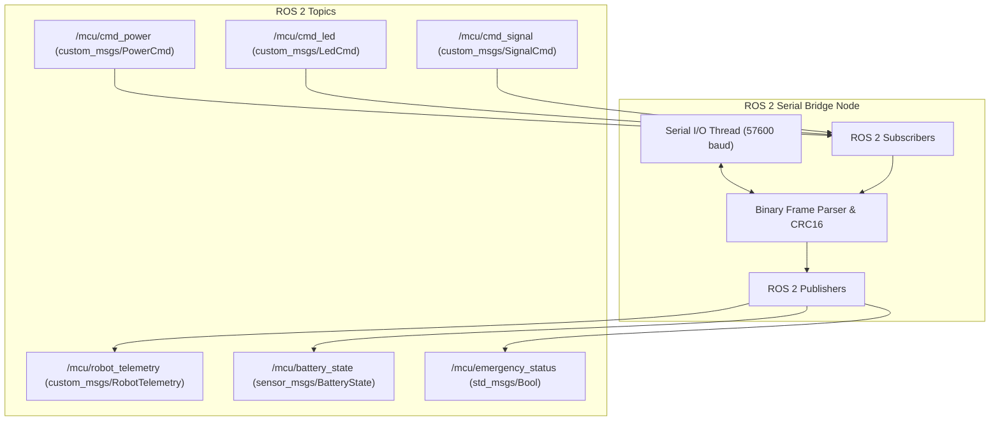

# Mobile Humanoid MCU 전용 바이너리 시리얼 프로토콜 명세서

## 1. 개요 (Overview)
본 문서는 **Mobile Humanoid MCU (ATmega2560)**와 **메인 내비게이션 PC (Ubuntu / ROS 2)** 간의 UART 시리얼 통신을 위한 고신뢰성 경량 바이너리 프로토콜 명세서입니다.

- **인터페이스**: UART (USB-to-TTL Serial `/dev/ttyUSBx`)
- **기본 통신 속도 (Baud Rate)**: `57,600 bps` (설정에 따라 변경 가능)
- **데이터 형식**: 8 Data bits, No Parity, 1 Stop bit (8N1)
- **바이트 오더 (Byte Order)**: Little-Endian (하위 바이트 우선)

---

## 2. 패킷 프레임 포맷 (Packet Frame Structure)

모든 데이터는 아래의 표준 프레임 구조를 따라 송수신됩니다.

```text
┌───────────┬───────────┬────────┬─────────────┬───────────────────┬──────────────┬──────────────┐
│ HEADER 1  │ HEADER 2  │ MSG_ID │ LENGTH (N)  │  PAYLOAD (0~64 B) │ CRC16 (Low)  │ CRC16 (High) │
│   0xAA    │   0x55    │ (1 B)  │    (1 B)    │    (가변/고정)    │    (1 B)     │    (1 B)     │
└───────────┴───────────┴────────┴─────────────┴───────────────────┴──────────────┴──────────────┘
```

| 필드 | 크기 | 값 / 범위 | 설명 |
| :--- | :---: | :---: | :--- |
| **HEADER 1** | 1 Byte | `0xAA` | 패킷 시작 매직 넘버 1 |
| **HEADER 2** | 1 Byte | `0x55` | 패킷 시작 매직 넘버 2 |
| **MSG_ID** | 1 Byte | `0x01` ~ `0x14` | 메시지 식별자 |
| **LENGTH** | 1 Byte | `0` ~ `64` | 뒤따르는 페이로드(Payload)의 바이트 수 ($N$) |
| **PAYLOAD** | $N$ Byte | Binary Struct | 메시지 구조체 데이터 |
| **CRC16 (L)** | 1 Byte | `0x00` ~ `0xFF` | CRC16-CCITT 하위 바이트 (LSB) |
| **CRC16 (H)** | 1 Byte | `0x00` ~ `0xFF` | CRC16-CCITT 상위 바이트 (MSB) |

---

## 3. CRC-16 무결성 검증 알고리즘

- **표준**: CRC-16-CCITT
- **다항식 (Polynomial)**: `0x1021` ($x^{16} + x^{12} + x^5 + 1$)
- **초기값 (Initial Value)**: `0xFFFF`
- **검증 범위**: `HEADER 1` 부터 `PAYLOAD` 끝까지 (총 $4 + N$ 바이트)

### C / C++ 레퍼런스 코드
```cpp
uint16_t calcCRC16(const uint8_t* data, uint16_t length) {
  uint16_t crc = 0xFFFF;
  for (uint16_t i = 0; i < length; i++) {
    crc ^= (uint16_t)data[i] << 8;
    for (uint8_t bit = 0; bit < 8; bit++) {
      if (crc & 0x8000) crc = (crc << 1) ^ 0x1021;
      else              crc <<= 1;
    }
  }
  return crc;
}
```

### Python 레퍼런스 코드
```python
def calc_crc16(data: bytes) -> int:
    crc = 0xFFFF
    for byte in data:
        crc ^= (byte << 8)
        for _ in range(8):
            if crc & 0x8000:
                crc = ((crc << 1) ^ 0x1021) & 0xFFFF
            else:
                crc = (crc << 1) & 0xFFFF
    return crc
```

---

## 4. 메시지 상세 정의 (Message Definitions)

### 4.1 MCU $\rightarrow$ PC (Telemetry & Information)

#### 1) `MSG_ID_ROBOT_TELEMETRY (0x01)` — 로봇 통합 텔레메트리
- **전송 주기**: 20Hz (50ms 주기 송신)
- **페이로드 길이**: 13 Bytes

| 오프셋 | 필드명 | 타입 | 크기 | 설명 |
| :---: | :--- | :---: | :---: | :--- |
| `0` | `btn_status` | `uint8` | 1 B | **버튼 상태 비트마스크**<br/>- Bit 0: Power Button (`PWR_BTN`)<br/>- Bit 1: Start Button (`START_BTN`)<br/>- Bit 2: Stop Button (`STOP_BTN`)<br/>- Bit 3: Manual Mode Switch (`MANU_SW`) |
| `1` | `pc_live_status` | `uint8` | 1 B | **3대 PC 부팅 상태 비트마스크**<br/>- Bit 0: Nav PC Live (`PC_PWR_LIVE`)<br/>- Bit 1: Humanoid PC Live (`HUMANOID_PC_LIVE`)<br/>- Bit 2: AI PC Live (`AI_PC_LIVE`) |
| `2` | `safety_status` | `uint8` | 1 B | **안전 및 충전 감지 비트마스크**<br/>- Bit 0: Safety PLC Emergency (`SAFETY_EMS`, 1=비상정지)<br/>- Bit 1: 수동 충전 도크 감지 (`MANU_CHG_DET`)<br/>- Bit 2: 충전 전류 활성 상태 (`IS_CHARGING`) |
| `3` | `output_status` | `uint8` | 1 B | **출력 릴레이 및 램프 상태 비트마스크**<br/>- Bit 0: `PWR_HOLD`<br/>- Bit 1: `VOLT24V_1` (24V Conv 1)<br/>- Bit 2: `VOLT24V_2` (24V Conv 2)<br/>- Bit 3: `CHG_ON_ENABLE`<br/>- Bit 4: Tower Lamp RED (`LAMP_RED`)<br/>- Bit 5: Tower Lamp GREEN (`LAMP_GRN`)<br/>- Bit 6: Tower Lamp YELLOW (`LAMP_YEL`)<br/>- Bit 7: Buzzer (`BUZZER`) |
| `4~7` | `chg_current_adc` | `float32` | 4 B | 충전 전류 측정값 (Amperes / ADC Voltage) |
| `8` | `led_current_mode` | `uint8` | 1 B | 현재 동작 중인 LED 모드 번호 (0~55) |
| `9~12` | `uptime_sec` | `uint32` | 4 B | MCU 부팅 후 가동 시간 (초) |

---

#### 2) `MSG_ID_BMS_TELEMETRY (0x02)` — BMS 배터리 텔레메트리
- **전송 주기**: 1Hz (1000ms 주기 송신)
- **페이로드 길이**: 21 Bytes

| 오프셋 | 필드명 | 타입 | 크기 | 설명 |
| :---: | :--- | :---: | :---: | :--- |
| `0~3` | `voltage` | `float32` | 4 B | 배터리 총 전압 (V) |
| `4~7` | `current` | `float32` | 4 B | 배터리 충/방전 전류 (A, 충전 시 +, 방전 시 -) |
| `8~11` | `soc` | `float32` | 4 B | 잔여 용량 SoC (%) |
| `12~15` | `soh` | `float32` | 4 B | 배터리 수명 SoH (%) |
| `16~19` | `temp` | `float32` | 4 B | 배터리 온도 (°C) |
| `20` | `is_valid` | `uint8` | 1 B | BMS 유효 여부 (1: 정상, 0: 통신 실패/타임아웃) |

---

#### 3) `MSG_ID_SYSTEM_INFO (0x03)` — MCU 시스템 정보
- **전송 조건**: 부팅 시 1회 전송 또는 PC 요청 시(`0x14`) 응답
- **페이로드 길이**: 48 Bytes

| 오프셋 | 필드명 | 타입 | 크기 | 설명 |
| :---: | :--- | :---: | :---: | :--- |
| `0~23` | `sw_ver` | `char[24]` | 24 B | 펌웨어 버전 문자열 (`"MOBILE_HUMANOID_MCU_v1.0"`) |
| `24~47`| `hw_ver` | `char[24]` | 24 B | 하드웨어 사양 버전 (`"Mobile_Humanoid_IO_v1.0"`) |

---

#### 4) `MSG_ID_ACK_NACK (0x04)` — 명령 수신 응답
- **전송 조건**: PC로부터 제어 명령 수신 즉시 응답
- **페이로드 길이**: 2 Bytes

| 오프셋 | 필드명 | 타입 | 크기 | 설명 |
| :---: | :--- | :---: | :---: | :--- |
| `0` | `target_msg_id` | `uint8` | 1 B | 수신한 커맨드의 Msg ID |
| `1` | `status_code` | `uint8` | 1 B | **결과 코드**<br/>- `0x00`: `ACK_STATUS_OK` (정상 처리)<br/>- `0x01`: `ACK_STATUS_CRC_ERROR` (CRC 오류)<br/>- `0x02`: `ACK_STATUS_INVALID_LEN` (길이 오류)<br/>- `0x03`: `ACK_STATUS_INVALID_CMD` (알 수 없는 명령)<br/>- `0x04`: `ACK_STATUS_EXEC_FAILED` (실행 실패) |

---

### 4.2 PC $\rightarrow$ MCU (Commands)

#### 1) `MSG_ID_CMD_POWER_CTRL (0x10)` — 전원 제어 명령
- **페이로드 길이**: 2 Bytes

| 오프셋 | 필드명 | 타입 | 크기 | 설명 |
| :---: | :--- | :---: | :---: | :--- |
| `0` | `target_device` | `uint8` | 1 B | **제어 대상 디바이스**<br/>- `1`: Humanoid Control PC (`PIN_HUMANOID_PC_ON`)<br/>- `2`: AI Humanoid PC (`PIN_AI_PC_ON`)<br/>- `3`: 24V Converter 1 (`PIN_VOLT24V_1`)<br/>- `4`: 24V Converter 2 (`PIN_VOLT24V_2`)<br/>- `5`: Main Nav PC (`PIN_PC_PWR_SW`) |
| `1` | `action` | `uint8` | 1 B | **제어 동작**<br/>- `0`: OFF (또는 셧다운)<br/>- `1`: ON<br/>- `2`: PULSE (500ms 전원 스위치 On 펄스) |

---

#### 2) `MSG_ID_CMD_LED_CTRL (0x11)` — LED 스트립 제어 명령
- **페이로드 길이**: 5 Bytes

| 오프셋 | 필드명 | 타입 | 크기 | 설명 |
| :---: | :--- | :---: | :---: | :--- |
| `0` | `mode` | `uint8` | 1 B | LED 모드 번호 (`LED_CTRL` enum, 0: OFF, 6: FULL_RED, 25: BLINK_RED, 33: INDI_RIGHT 등) |
| `1` | `r` | `uint8` | 1 B | 사용자 지정 Red (0 ~ 255) |
| `2` | `g` | `uint8` | 1 B | 사용자 지정 Green (0 ~ 255) |
| `3` | `b` | `uint8` | 1 B | 사용자 지정 Blue (0 ~ 255) |
| `4` | `brightness` | `uint8` | 1 B | 스트립 전체 밝기 (0 ~ 255, 기본 200) |

---

#### 3) `MSG_ID_CMD_SIGNAL_CTRL (0x12)` — 시그널 타워 / 부저 / TM Remote 제어
- **페이로드 길이**: 5 Bytes (각 항목 `0`: OFF, `1`: ON, `0xFF`: 현재 상태 유지)

| 오프셋 | 필드명 | 타입 | 크기 | 설명 |
| :---: | :--- | :---: | :---: | :--- |
| `0` | `lamp_red` | `uint8` | 1 B | Signal Tower RED (`LAMP_RED`) |
| `1` | `lamp_grn` | `uint8` | 1 B | Signal Tower GREEN (`LAMP_GRN`) |
| `2` | `lamp_yel` | `uint8` | 1 B | Signal Tower YELLOW (`LAMP_YEL`) |
| `3` | `buzzer` | `uint8` | 1 B | Buzzer Output (`BUZZER`) |
| `4` | `tm_remote` | `uint8` | 1 B | TM Remote Output (`TM_RMT`) |

---

#### 4) `MSG_ID_CMD_BMS_CTRL (0x13)` — BMS 및 충전 제어
- **페이로드 길이**: 2 Bytes

| 오프셋 | 필드명 | 타입 | 크기 | 설명 |
| :---: | :--- | :---: | :---: | :--- |
| `0` | `bms_reset_pulse` | `uint8` | 1 B | `1` 전송 시 BMS 리셋 펄스 시퀀스 실행 |
| `1` | `chg_enable` | `uint8` | 1 B | `0`: 자동 충전 접점 차단, `1`: 자동 충전 접점 연결 (`CHG_ON_ENABLE`) |

---

#### 5) `MSG_ID_CMD_REQUEST_INFO (0x14)` — 시스템 정보 요청
- **페이로드 길이**: 0 Bytes (Payload 없음)
- MCU는 수신 즉시 `MSG_ID_SYSTEM_INFO (0x03)`로 응답합니다.

---

## 5. ROS 2 Bridge 노드 연동 가이드

PC 측 ROS 2 Bridge 노드(`mcu_serial_bridge`)를 구현할 때 아래와 같이 토픽을 매핑하여 발행/구독하도록 구성합니다.


