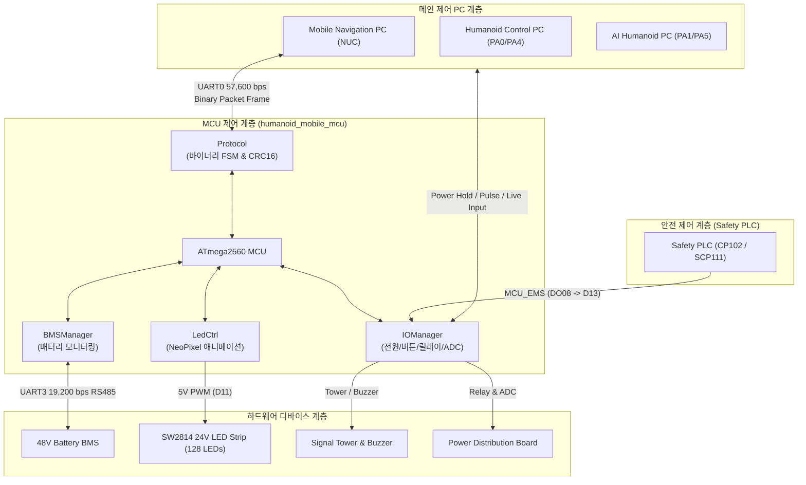

# Mobile Humanoid MCU 펌웨어 (ATmega2560)

## 1. 개요 (Overview)
본 펌웨어는 **모바일 휴머노이드(Mobile Humanoid) 로봇의 메인 MCU (Arduino Mega 2560 / ATmega2560)** 전용 임베디드 제어 소프트웨어이다.  

- **타겟 MCU**: Microchip ATmega2560 (8-bit AVR, Flash 256KB, SRAM 8KB, EEPROM 4KB)
- **개발 환경**: Arduino IDE / Arduino CLI 표준 C/C++ (C++11 지원)
- **주요 기능**: 3대 멀티 PC 전원 시퀀스 관리, Safety PLC 비상정지 연동, 48V BMS 배터리 모니터링, 24V LED 스트립 애니메이션 제어, 시그널 타워/부저 제어, 충전 전류 센싱

---

## 2. 시스템 아키텍처 및 통신 사양



### 통신 인터페이스 사양
1. **메인 PC 통신 (UART0 / `Serial`)**:
   - **물리 계층**: USB-to-TTL Serial (`/dev/ttyUSBx`)
   - **통신 속도**: `57,600 bps` (8 Data bits, No Parity, 1 Stop bit)
   - **프로토콜**: 고유 바이너리 패킷 프레임 + CRC-16-CCITT 무결성 검증
2. **BMS 배터리 통신 (UART3 / `Serial3`)**:
   - **물리 계층**: RS-485 트랜시버 인터페이스
   - **통신 속도**: `19,200 bps` (8 Data bits, No Parity, 1 Stop bit)
   - **주기**: 1Hz 폴링 (`0xAF 0xFA 0x60 ... 0xAF 0xA0`)

---

## 3. 하드웨어 핀 맵 명세 (`config.h`)

하드웨어 I/O 사양서(`Mobile Humanoid_IO_List_ver1.0.xlsx`)와 100% 매핑된 MCU 핀 정의이다.

| 커넥터 | 핀 번호 | 포트 | 핀 명칭 | 신호 타입 | 기능 설명 |
| :--- | :---: | :---: | :--- | :---: | :--- |
| **CON3** | `D06` | `PH3` | `PIN_PWR_BTN_IN` | Digital Input (NPN) | 메인 전원 버튼 입력 |
| **CON3** | `D47` | `PL2` | `PIN_PWR_BTN_LAMP` | Digital Output (NPN) | 메인 전원 버튼 램프 출력 |
| **CON3** | `D07` | `PH4` | `PIN_MANU_SW_IN` | Digital Input (NPN) | 수동 모드 선택 스위치 입력 |
| **CON3** | `D46` | `PL3` | `PIN_SW1_OUT2` | Digital Output (NPN) | Switch #1 예비 출력 |
| **CON4** | `D08` | `PH5` | `PIN_START_BTN_IN` | Digital Input (NPN) | 시작(Start) 버튼 입력 |
| **CON4** | `D45` | `PL4` | `PIN_START_BTN_LAMP` | Digital Output (NPN) | 시작 버튼 램프 출력 |
| **CON4** | `D09` | `PH6` | `PIN_STOP_BTN_IN` | Digital Input (NPN) | 정지(Stop) 버튼 입력 |
| **CON4** | `D44` | `PL5` | `PIN_STOP_BTN_LAMP` | Digital Output (NPN) | 정지 버튼 램프 출력 |
| **CON4** | `D69` | `PK7` | `PIN_BUZZER` | Digital Output (PNP) | 경보 부저(Buzzer) 출력 |
| **CON5** | `D31` | `PC6` | `PIN_PC_PWR_SW` | Relay Output (A접점) | 메인 Nav PC 전원 ON/OFF 펄스 스위치 |
| **CON5** | `D42` | `PL7` | `PIN_PC_PWR_LIVE` | Digital Input (12V Opto) | 메인 Nav PC 부팅 완료 상태 감지 |
| **CON7** | `D30` | `PC7` | `PIN_TM_RMT` | Relay Output (A접점) | TM Remote ON/OFF 제어 출력 |
| **CON9** | `D22` | `PA0` | `PIN_HUMANOID_PC_LIVE`| Digital Input (NPN) | 휴머노이드 제어 PC 부팅 상태 입력 |
| **CON9** | `D23` | `PA1` | `PIN_AI_PC_LIVE` | Digital Input (NPN) | AI 휴머노이드 PC 부팅 상태 입력 |
| **CON9** | `D26` | `PA4` | `PIN_HUMANOID_PC_ON` | Digital Output (NPN) | 휴머노이드 제어 PC ON 펄스 출력 |
| **CON9** | `D27` | `PA5` | `PIN_AI_PC_ON` | Digital Output (NPN) | AI 휴머노이드 PC ON 펄스 출력 |
| **CON10**| `D66` | `PK4` | `PIN_LAMP_RED` | Digital Output (PNP) | 시그널 타워 적색(RED) 램프 |
| **CON10**| `D67` | `PK5` | `PIN_LAMP_GRN` | Digital Output (PNP) | 시그널 타워 녹색(GREEN) 램프 |
| **CON10**| `D68` | `PK6` | `PIN_LAMP_YEL` | Digital Output (PNP) | 시그널 타워 황색(YELLOW) 램프 |
| **CON11**| `D13` | `PB7` | `PIN_SAFETY_EMS` | Digital Input (Active Low) | Safety PLC 비상정지 알람 수신 (DO08 연동) |
| **CON1** | `D43` | `PL6` | `PIN_BMS_SW` | Relay Output (A접점) | BMS 전원 리셋/웨이크업 릴레이 |
| **CON1** | `D03` | `PE5` | `PIN_MANU_CHG_DET` | Digital Input (NPN) | 수동 충전 단자 도킹 감지 입력 |
| **CON15**| `A1` | `PF1` | `PIN_CHG_DET_ADC` | Analog Input (0~5V) | 충전 전류 아날로그 전압 센싱 |
| **CON15**| `A0` | `PF0` | `PIN_CHG_ON_ENABLE` | Digital Output | 자동 충전 접점 연결 인에이블 출력 |
| **CON15**| `A2` | `PF2` | `PIN_PWR_HOLD` | Digital Output | 메인 전원 래치 유지 출력 (Power Hold) |
| **CON15**| `A9/D63`| `PK1`| `PIN_VOLT24V_1` | Digital Output | 24V 컨버터 #1 Remote 제어 |
| **CON15**| `A10/D64`| `PK2`| `PIN_VOLT24V_2` | Digital Output | 24V 컨버터 #2 Remote 제어 |
| **CON2** | `D11` | `PB5` | `PIN_LED_INDI` | 5V PWM Output | 하부/측면 SW2814 24V LED 스트립 제어 |
| **Onboard**| `D39` | `PG2` | `PIN_LIVE_LED` | Digital Output | MCU 가동 1Hz 하트비트 표시 LED |

---

## 4. 바이너리 시리얼 프로토콜 명세 (`protocol.h` / `protocol.cpp`)

### 4.1 패킷 프레임 포맷
```text
┌───────────┬───────────┬────────┬─────────────┬───────────────────┬──────────────┬──────────────┐
│ HEADER 1  │ HEADER 2  │ MSG_ID │ LENGTH (N)  │  PAYLOAD (0~64 B) │ CRC16 (Low)  │ CRC16 (High) │
│   0xAA    │   0x55    │ (1 B)  │    (1 B)    │    (Little-Endian)│    (1 B)     │    (1 B)     │
└───────────┴───────────┴────────┴─────────────┴───────────────────┴──────────────┴──────────────┘
```
- **HEADER**: `0xAA 0x55` (2바이트 고정 매직 넘버)
- **MSG_ID**: 메시지 식별자 (1바이트)
- **LENGTH**: 뒤따르는 페이로드의 바이트 크기 ($N \le 64$)
- **PAYLOAD**: 1바이트 정렬(`pragma pack(push, 1)`) 구조체 바이너리 데이터
- **CRC-16**: CRC-16-CCITT (다항식: `0x1021`, 초기값: `0xFFFF`), `HEADER 1`부터 `PAYLOAD` 끝까지의 전 영역을 검증.

### 4.2 메시지 세부 정의

#### MCU $\rightarrow$ PC (텔레메트리 및 정보)
| Msg ID | 메시지 명칭 | 주기 / 전송 조건 | 크기 | 주요 내용 |
| :---: | :--- | :---: | :---: | :--- |
| **`0x01`** | `MSG_ID_ROBOT_TELEMETRY` | 20Hz (50ms) | 13 B | 버튼 상태 비트필드(PWR/START/STOP/MANU), 3대 PC 부팅 상태, Safety PLC 비상정지 신호, 24V Conv 출력 상태, 충전 전류 ADC (Float 4B), 현재 LED 모드, Uptime (초) |
| **`0x02`** | `MSG_ID_BMS_TELEMETRY` | 1Hz (1000ms) | 21 B | 배터리 총 전압(V), 충방전 전류(A), SoC(%), SoH(%), 온도(°C), 통신 유효 플래그 |
| **`0x03`** | `MSG_ID_SYSTEM_INFO` | 부팅 시 / 요청 시 | 48 B | 펌웨어 버전 문자열(`sw_ver[24]`), 하드웨어 버전 문자열(`hw_ver[24]`) |
| **`0x04`** | `MSG_ID_ACK_NACK` | 커맨드 수신 즉시 | 2 B | 대상 커맨드 Msg ID (`target_msg_id`), 처리 결과 코드 (`0x00: OK`, `0x01: CRC_ERR`, `0x02: INVALID_LEN`, `0x03: INVALID_CMD`, `0x04: EXEC_FAILED`) |

#### PC $\rightarrow$ MCU (제어 명령)
| Msg ID | 커맨드 명칭 | 페이로드 크기 | 파라미터 구조 |
| :---: | :--- | :---: | :--- |
| **`0x10`** | `MSG_ID_CMD_POWER_CTRL` | 2 B | `target_device` (1: Humanoid PC, 2: AI PC, 3: 24V #1, 4: 24V #2, 5: Main Nav PC), `action` (0: OFF, 1: ON, 2: PULSE) |
| **`0x11`** | `MSG_ID_CMD_LED_CTRL` | 5 B | `mode` (LED_CTRL enum 0~55), `r`, `g`, `b`, `brightness` (0~255) |
| **`0x12`** | `MSG_ID_CMD_SIGNAL_CTRL`| 5 B | `lamp_red`, `lamp_grn`, `lamp_yel`, `buzzer`, `tm_remote` (0: OFF, 1: ON, 255: 유지) |
| **`0x13`** | `MSG_ID_CMD_BMS_CTRL` | 2 B | `bms_reset_pulse` (1: 리셋 시퀀스 실행), `chg_enable` (1: 자동 충전 접점 연결) |
| **`0x14`** | `MSG_ID_CMD_REQUEST_INFO`| 0 B | 페이로드 없음. MCU는 즉시 `0x03 (SYSTEM_INFO)`로 응답. |

---

## 5. 소스 코드 모듈 구조 및 기능 상세

```text
mobile/humanoid_mobile_mcu/
├── config.h         # 핀 맵, 보드레이트, 타이밍 주기, LED 모드 상수 정의
├── protocol.h       # 바이너리 패킷 구조체, CRC16, PacketParser 클래스 선언
├── protocol.cpp     # CRC16 계산 및 FSM 바이트 스트림 파서 구현
├── io_manager.h     # I/O 디바운스, 전원 시퀀스, 안전/알람 제어기 선언
├── io_manager.cpp   # GPIO 초기화, 전원 버튼 상태머신, 멀티 PC 펄스 로직 구현
├── bms.h            # Serial3 RS485 통신 및 배터리 데이터 관리자 선언
├── bms.cpp          # BMS 1Hz 질의 패킷 전송, 응답 파싱 및 리셋 시퀀스 구현
├── led_ctrl.h       # Adafruit_NeoPixel 기반 비동기 LED 제어기 선언
├── led_ctrl.cpp     # 비차단 프레임 렌더러, 방향지시등, 충전게이지 애니메이션 구현
└── main.ino         # 아두이노 IDE 표준 메인 스케치 및 스케줄러 루프
```

### 모듈별 세부 역할
1. **`io_manager`**:
   - **전원 버튼 상태 머신**: 버튼 2초 누름 감지 시 메인 PC 정상 셧다운 요청, 7초 누름 시 하드웨어 강제 셧다운(`PWR_HOLD` 릴리즈).
   - **멀티 PC 제어**: Nav PC 부팅(`PC_PWR_LIVE`) 완료 시 자동으로 `PWR_HOLD` 래치. Humanoid PC 및 AI PC에 500ms 전원 On 펄스 인가.
   - **Safety PLC 연동**: 비상정지 입력(`D13`, Active Low) 감지 시 자동으로 부저 울림, 적색 타워 램프 점등 및 LED 전역 적색 전환.
   - **충전 감지**: `A1` 아날로그 전압 샘플링을 통해 충전 전류 측정 및 충전 활성 상태 감지.
2. **`bms`**:
   - `Serial3`를 통해 1000ms 주기로 `0xAF 0xFA 0x60 0x05 0x01 0x60 0x47 0x01 [Checksum] 0xAF 0xA0` 패킷을 전송.
   - 0.01V 단위 전압, 0.01A 단위 전류, SoC/SoH, 0.1°C 단위 온도를 부동소수점(`float`)으로 정밀 변환.
3. **`led_ctrl`**:
   - 단일 스레드 환경에서 `delay()` 없이 20Hz 비차단(Non-blocking) 타이머로 구동.
   - 비상정지(최우선 순위), 충전 게이지 애니메이션, 방향지시등(Right/Left Blink), 단색/와이프/페이드 모드 지원.
4. **`main.ino`**:
   - 20Hz 비차단 루프로 I/O 갱신, BMS 폴링, LED 렌더링을 통합 스케줄링.
   - 50ms마다 `RobotTelemetry` (20Hz), 1000ms마다 `BmsTelemetry` (1Hz)를 PC로 전송.

---

## 6. 빌드 및 업로드 방법

### 아두이노 IDE (GUI)
1. 아두이노 IDE에서 [`mobile/humanoid_mobile_mcu/main.ino`](file:///home/void/workspace/humanoid_tmp_ws/mobile/humanoid_mobile_mcu/main.ino) 파일을 연다. (동일 폴더의 `.h`/`.cpp` 파일이 자동으로 탭으로 인식됨)
2. 라이브러리 관리자에서 **`Adafruit NeoPixel`** 라이브러리를 설치한다.
3. **도구(Tools) $\rightarrow$ 보드(Board)**: `Arduino Mega or Mega 2560` 선택.
4. **도구(Tools) $\rightarrow$ 프로세서(Processor)**: `ATmega2560 (Mega 2560)` 선택.
5. 포트 선택 후 **업로드(Upload)**를 실행한다.

### Arduino CLI (Command Line)
```bash
# 아두이노 코어 및 라이브러리 설치
arduino-cli core install arduino:avr
arduino-cli lib install "Adafruit NeoPixel"

# 컴파일
arduino-cli compile --fqbn arduino:avr:mega /home/void/workspace/humanoid_tmp_ws/mobile/humanoid_mobile_mcu

# 펌웨어 업로드 (포트가 /dev/ttyUSB0 인 경우)
arduino-cli upload -p /dev/ttyUSB0 --fqbn arduino:avr:mega /home/void/workspace/humanoid_tmp_ws/mobile/humanoid_mobile_mcu
```

---

## 7. 호스트 검증 도구 연동
PC 측에서 펌웨어의 시리얼 통신을 검증할 때는 [`mobile/tools/mcu_serial_tester.py`](file:///home/void/workspace/humanoid_tmp_ws/mobile/tools/mcu_serial_tester.py) 또는 ROS 2 브릿지 패키지([`mobile/humanoid_mobile_mcu_ros`](file:///home/void/workspace/humanoid_tmp_ws/mobile/humanoid_mobile_mcu_ros))를 사용한다.

```bash
# 1. 시리얼 패킷 인코딩/디코딩 셀프 테스트 (하드웨어 없이 자체 검증)
python3 mobile/tools/mcu_serial_tester.py --test

# 2. 실제 MCU 연결 실시간 텔레메트리 모니터링 CLI
python3 mobile/tools/mcu_serial_tester.py -p /dev/ttyUSB0 -b 57600
```
