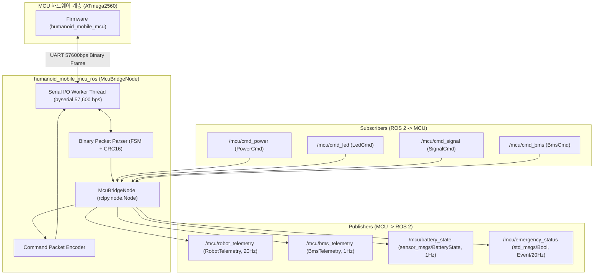

# humanoid_mobile_mcu_ros

## 1. 개요 (Overview)
**`humanoid_mobile_mcu_ros`**는 모바일 휴머노이드 로봇의 메인 내비게이션 PC(ROS 2)와 하부 전원/안전 제어 MCU(ATmega2560) 간의 바이너리 시리얼 통신을 중계하는 **ROS 2 시리얼 브릿지(Serial Bridge) 노드 및 커스텀 메시지 패키지**이다.

- **빌드 시스템**: `ament_cmake` 기반 하이브리드 패키지 (C++ & Python 커스텀 인터페이스 빌드 + `rclpy` Python 노드 실행)
- **통신 인터페이스**: UART 시리얼 (`57,600 bps`, Little-Endian, CRC-16-CCITT 무결성 검증)
- **주요 기능**:
  - MCU 텔레메트리 데이터 실시간 수신 및 ROS 2 표준/커스텀 토픽 변환 발행 (20Hz Robot 텔레메트리, 1Hz BMS 텔레메트리)
  - 상위 노드의 제어 명령(전원, LED, 시그널 타워, 부저, 충전)을 바이너리 패킷으로 인코딩하여 MCU로 전달
  - 시리얼 통신 단절 시 자동 복구(Auto-Reconnect) 및 백그라운드 수신 스레드 관리
  - 표준 `sensor_msgs/msg/BatteryState` 동시 지원

---

## 2. 시스템 아키텍처 및 데이터 흐름



---

## 3. ROS 2 토픽 인터페이스 명세

### 3.1 Publishers (MCU $\rightarrow$ ROS 2)

| 토픽명 | 메시지 타입 | QoS Profile | 주기 | 상세 설명 |
| :--- | :--- | :---: | :---: | :--- |
| **`/mcu/robot_telemetry`** | `humanoid_mobile_mcu_ros/msg/RobotTelemetry` | Best Effort (Sensor) | 20Hz | 로봇 종합 상태 (버튼 입력 4종, 3대 PC 부팅 상태, Safety PLC 비상정지 신호, 24V Conv 출력, 충전 ADC 전압, LED 모드, 가동 시간) |
| **`/mcu/bms_telemetry`** | `humanoid_mobile_mcu_ros/msg/BmsTelemetry` | Best Effort (Sensor) | 1Hz | 48V 배터리 상세 데이터 (전압, 전류, SoC, SoH, 온도, 통신 유효 플래그) |
| **`/mcu/battery_state`** | `sensor_msgs/msg/BatteryState` | Best Effort (Sensor) | 1Hz | ROS 2 표준 배터리 메시지 (전압, 전류, 잔여율 0.0~1.0, 충/방전 상태 플래그) |
| **`/mcu/emergency_status`**| `std_msgs/msg/Bool` | Reliable (Transient) | 20Hz | Safety PLC 비상정지(Emergency) 활성화 여부 (`True`: 비상정지 상태) |

### 3.2 Subscribers (ROS 2 $\rightarrow$ MCU)

| 토픽명 | 메시지 타입 | QoS Profile | 상세 설명 |
| :--- | :--- | :---: | :--- |
| **`/mcu/cmd_power`** | `humanoid_mobile_mcu_ros/msg/PowerCmd` | Reliable | 3대 PC 및 24V 컨버터 전원 제어 (1: Humanoid PC, 2: AI PC, 3: 24V#1, 4: 24V#2, 5: Nav PC / Action: 0=OFF, 1=ON, 2=PULSE) |
| **`/mcu/cmd_led`** | `humanoid_mobile_mcu_ros/msg/LedCmd` | Reliable | 하부/측면 24V SW2814 LED 스트립 모드(0~55), 사용자 지정 RGB 및 밝기(0~255) 제어 |
| **`/mcu/cmd_signal`** | `humanoid_mobile_mcu_ros/msg/SignalCmd` | Reliable | 시그널 타워 램프(Red/Green/Yellow), 경보 부저, TM Remote 제어 (0: OFF, 1: ON, 255: 유지) |
| **`/mcu/cmd_bms`** | `humanoid_mobile_mcu_ros/msg/BmsCmd` | Reliable | BMS 하드웨어 리셋 펄스 시퀀스 트리거 및 자동 충전 접점 On/Off 제어 |

---

## 4. 커스텀 메시지 상세 정의 (`msg/`)

### 1) `RobotTelemetry.msg` (20Hz 주기 로봇 종합 상태)
```protobuf
std_msgs/Header header

# 버튼 및 스위치 상태
bool pwr_btn            # 전원 버튼 눌림 상태
bool start_btn          # 시작 버튼 눌림 상태
bool stop_btn           # 정지 버튼 눌림 상태
bool manu_sw            # 수동 모드 스위치 상태

# 3대 PC 부팅 및 동작 상태
bool nav_pc_live        # 메인 내비게이션 PC (NUC) Live
bool humanoid_pc_live   # 휴머노이드 제어 PC Live
bool ai_pc_live         # AI 휴머노이드 PC Live

# 안전 및 충전 감지
bool safety_ems         # Safety PLC 비상정지 활성화 상태 (True: 비상정지)
bool manu_chg_dock      # 수동 충전 단자 도킹 감지
bool is_charging        # 충전 활성 상태 (전류 > 0.5A 또는 독 감지)

# 출력 릴레이 및 램프 상태
bool pwr_hold           # Main Power Hold 릴레이 상태
bool volt24v_1          # 24V Converter #1 Remote 상태
bool volt24v_2          # 24V Converter #2 Remote 상태
bool chg_on_enable      # 자동 충전 접점 인에이블 상태
bool lamp_red           # 시그널 타워 RED 램프 상태
bool lamp_grn           # 시그널 타워 GREEN 램프 상태
bool lamp_yel           # 시그널 타워 YELLOW 램프 상태
bool buzzer             # 경보 부저 출력 상태

# 아날로그 측정 및 상태
float32 chg_current_adc # 충전 전류 측정값 (Amperes / ADC Voltage)
uint8 led_current_mode  # 현재 LED 동작 모드 코드 (0~55)
uint32 uptime_sec       # MCU 부팅 후 가동 시간 (초)
```

### 2) `BmsTelemetry.msg` (1Hz 주기 배터리 상태)
```protobuf
std_msgs/Header header

float32 voltage         # 배터리 총 전압 (V)
float32 current         # 배터리 충/방전 전류 (A, 충전: +, 방전: -)
float32 soc             # 잔여 용량 State of Charge (%)
float32 soh             # 배터리 수명 State of Health (%)
float32 temp            # 배터리 내부 온도 (°C)
bool is_valid           # BMS 통신 유효 플래그 (True: 정상 수신)
```

### 3) `PowerCmd.msg` (전원 제어 명령)
```protobuf
uint8 TARGET_HUMANOID_PC = 1
uint8 TARGET_AI_PC        = 2
uint8 TARGET_24V_CONV_1   = 3
uint8 TARGET_24V_CONV_2   = 4
uint8 TARGET_MAIN_PC      = 5

uint8 ACTION_OFF   = 0
uint8 ACTION_ON    = 1
uint8 ACTION_PULSE = 2

uint8 target_device
uint8 action
```

### 4) `LedCmd.msg` (LED 스트립 제어 명령)
```protobuf
uint8 LED_OFF = 0
uint8 FULL_WHITE = 5
uint8 FULL_RED = 6
uint8 FULL_GREEN = 7
uint8 FULL_BLUE = 8
uint8 FULL_YELLOW = 10
uint8 BLINK_RED = 25
uint8 INDI_RIGHT_BLINK_GREEN = 34
uint8 INDI_LEFT_BLINK_GREEN = 40
uint8 INDI_FULL_RED = 51

uint8 mode              # 모드 번호 (0~56)
uint8 r                 # Red (0~255)
uint8 g                 # Green (0~255)
uint8 b                 # Blue (0~255)
uint8 brightness        # 밝기 (0~255, 기본 200)
```

### 5) `SignalCmd.msg` (타워 램프/부저 제어 명령)
```protobuf
uint8 STATE_OFF       = 0
uint8 STATE_ON        = 1
uint8 STATE_NO_CHANGE = 255

uint8 lamp_red
uint8 lamp_grn
uint8 lamp_yel
uint8 buzzer
uint8 tm_remote
```

### 6) `BmsCmd.msg` (BMS/충전 제어 명령)
```protobuf
uint8 bms_reset_pulse   # 1: BMS 리셋 시퀀스 실행
uint8 chg_enable        # 1: 자동 충전 접점 연결 (ON), 0: 접점 차단 (OFF)
```

---

## 5. 파라미터 설정 (`config/mcu_params.yaml`)

| 파라미터명 | 타입 | 기본값 | 설명 |
| :--- | :---: | :---: | :--- |
| `port` | string | `"/dev/ttyUSB0"` | MCU 시리얼 포트 경로 |
| `baud_rate` | int | `57600` | 통신 속도 (MCU `config.h`의 `PC_SERIAL_BAUD_RATE`와 일치) |
| `reconnect_interval_sec`| double | `2.0` | 시리얼 통신 단절 시 재연결 시도 주기 (초) |
| `frame_id` | string | `"mcu_link"` | 발행 메시지 헤더의 `frame_id` |
| `publish_battery_state` | bool | `true` | `sensor_msgs/BatteryState` 토픽 변환 발행 활성화 여부 |

---

## 6. 패키지 디렉터리 구조

```text
mobile/humanoid_mobile_mcu_ros/
├── CMakeLists.txt              # 빌드 설정 (커스텀 메시지 인터페이스 및 파이썬 모듈 설치)
├── package.xml                 # 패키지 메타데이터 및 의존성 정의
├── msg/                        # 커스텀 ROS 2 메시지 정의 파일 (6종)
├── config/
│   └── mcu_params.yaml         # 시리얼 포트 및 보드레이트 파라미터
├── launch/
│   └── mcu_bridge.launch.py    # 노드 실행 런치 파일
├── humanoid_mobile_mcu_ros/
│   ├── __init__.py             # 패키지 익스포트
│   ├── protocol.py             # 바이너리 패킷 프레임, CRC16, FSM 파서, 인코더/디코더
│   └── mcu_bridge_node.py      # rclpy 기반 시리얼 통신 및 토픽 중계 노드 본체
├── scripts/
│   └── mcu_bridge_node         # 노드 실행 진입점 바이너리
└── test/                       # 자동 테스트 스위트
    ├── virtual_mcu.py          # Linux PTY 기반 가상 ATmega2560 MCU 시뮬레이터
    ├── test_protocol.py        # protocol.py 대상 단위 테스트 (14개 항목)
    ├── test_mcu_bridge_node.py # mcu_bridge_node.py 대상 E2E 통합 테스트 (8개 항목)
    └── run_auto_test.py        # 원클릭 자동 테스트 러너 및 요약 리포터
```

---

## 7. 빌드 및 실행 방법

### 1) 패키지 빌드
```bash
cd /home/void/workspace/humanoid_tmp_ws
colcon build --packages-select humanoid_mobile_mcu_ros
source install/setup.bash
```

### 2) 런치 파일을 통한 실행 (권장)
```bash
# 기본 포트(/dev/ttyUSB0, 57600)로 실행
ros2 launch humanoid_mobile_mcu_ros mcu_bridge.launch.py

# 포트 지정 실행
ros2 launch humanoid_mobile_mcu_ros mcu_bridge.launch.py port:=/dev/ttyUSB1 baud_rate:=57600
```

### 3) 노드 단독 실행
```bash
ros2 run humanoid_mobile_mcu_ros mcu_bridge_node --ros-args -p port:=/dev/ttyUSB0 -p baud_rate:=57600
```

### 4) 토픽 데이터 확인 및 명령 테스트 예시
```bash
# 1. 텔레메트리 수신 확인
ros2 topic echo /mcu/robot_telemetry
ros2 topic echo /mcu/battery_state

# 2. LED 스트립 전체 적색 점등 명령
ros2 topic pub --once /mcu/cmd_led humanoid_mobile_mcu_ros/msg/LedCmd "{mode: 6, r: 255, g: 0, b: 0, brightness: 200}"

# 3. 시그널 타워 Red ON 및 부저 ON 명령
ros2 topic pub --once /mcu/cmd_signal humanoid_mobile_mcu_ros/msg/SignalCmd "{lamp_red: 1, lamp_grn: 0, lamp_yel: 0, buzzer: 1, tm_remote: 255}"

# 4. 휴머노이드 제어 PC 전원 On 펄스 인가 명령
ros2 topic pub --once /mcu/cmd_power humanoid_mobile_mcu_ros/msg/PowerCmd "{target_device: 1, action: 2}"
```

---

## 8. 가상 MCU 기반 자동 테스트 실행 (E2E Test)

실제 MCU 하드웨어가 연결되지 않은 환경에서도 내장된 **가상 MCU 시뮬레이터(VirtualMCU)**를 통해 전체 기능을 100% 자동 검증할 수 있다.

```bash
cd /home/void/workspace/humanoid_tmp_ws
source install/setup.bash

# 원클릭 자동 테스트 스위트 실행 (총 22개 항목 검증)
python3 mobile/humanoid_mobile_mcu_ros/test/run_auto_test.py
```

### 테스트 검증 항목 (22/22 PASS)
- **프로토콜 단위 테스트 (14개)**: CRC-16-CCITT 무결성, 5종 패킷 빌더, 4종 텔레메트리 디코더, FSM 노이즈 복구
- **노드 E2E 통합 테스트 (8개)**: System Info 핸드셰이크, 4종 텔레메트리 토픽 변환 수신, 4종 커맨드 패킷 송신, 시리얼 노이즈 복구
